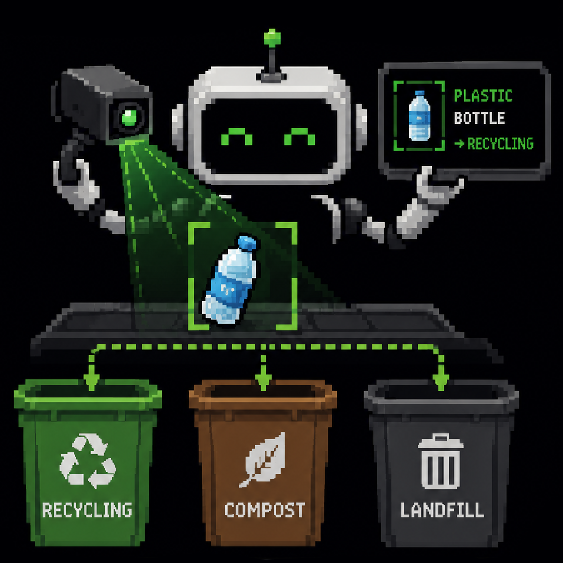
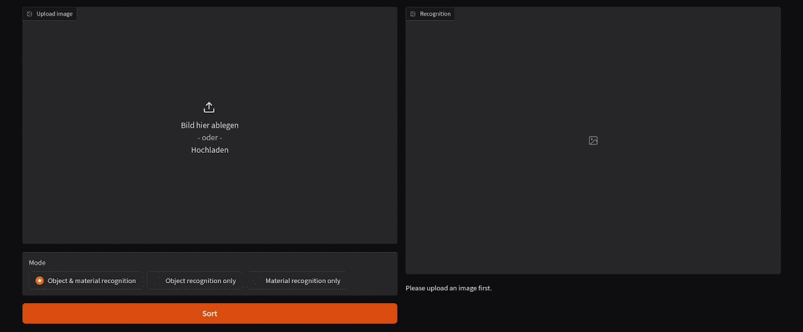
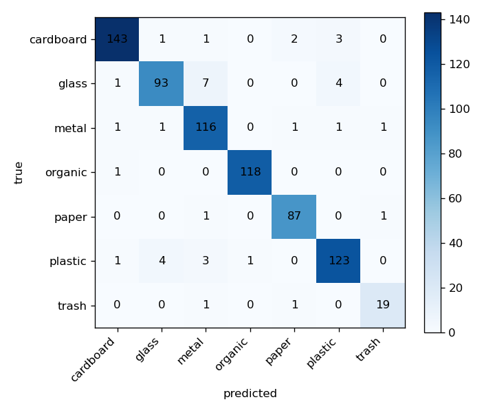

<div align="center">

  

# trashsort
</div>

### A smart trash sorter that recognizes items and tells you which German recycling bin it belongs in: built with Python, [PyTorch](https://github.com/pytorch/pytorch), [Gradio](https://github.com/gradio-app/gradio) and [Ultralytics YOLO + FastSAM](https://github.com/ultralytics/ultralytics), trained on [TrashNet](https://github.com/garythung/trashnet), [real fruit & vegetable photos](https://huggingface.co/datasets/Nattakarn/fruit-and-vegetable-image-recognition) and the [Freiburg Groceries dataset](http://aisdatasets.informatik.uni-freiburg.de/freiburg_groceries_dataset/)

<div align="center">

  ---
  [**Features**](#features) | [**Install**](#install) | [**How it works**](#how-it-works) | [**Evolution**](#how-the-project-evolved)

  ---

</div>

## Features

🗑️ **Sorts into German bins**: maps items to Papier, Gelbe Tonne, Altglas, Biomüll, Restmüll and Elektroschrott following the *Mülltrennung* rules

🔍 **Two-stage recognition**: an object detector names things it knows (e.g. banana → Biomüll), a material classifier handles everything else (glass, plastic, paper, cardboard, metal, organic, trash)

🧠 **Train your own model**: using the provided datasets

🖥️ **All in a Gradio app**: upload an image, pick a mode and see what bin the object belongs to

<div align="center">

  

</div>

## Confusion matrix

<div align="center">

  
</div>

The material classifier was tested on **737 new images** that the model never saw during training, drawn from **TrashNet**, the **real fruit & veg** photos and **Freiburg Groceries** packaging. It reaches **94.8% accuracy** across the 7 material classes, with `organic` (99%) and `cardboard` (96%) the strongest.


## Install

1. **Clone the repository**
```
git clone https://github.com/ris5266/trashsort.git
cd trashsort
```

2. **Install the dependencies**
```
pip install -r requirements.txt
pip install -e .
```

3. **Train the classifier**: download the datasets and train the material model
```
python scripts/download_trashnet.py     # TrashNet dataset
python scripts/download_organic.py      # organic dataset
python scripts/download_groceries.py    # supermarket dataset
python scripts/add_groceries.py         # map packaging -> material classes
python -m trashsort.train
```

4. **Launch the app**
```
python -m trashsort.app
```

## How it works

When you upload an image, it runs through a three-stage process:

1. **Cut out the object:** COCO-pretrained YOLOv8-seg detector localizes objects with bounding boxes (good for transparent objects like bottles). For anything it doesn't recognize, **FastSAM** frames the main object instead.

2. **Recognize the object:** If the detector names a waste object *(above a confidence gate)*, it maps straight to a bin (`e.g. banana → Biomüll)`.

3. **Classify the material:** Otherwise an **EfficientNet-B0** CNN predicts the *material* of the crop `(cardboard, glass, metal, organic, paper, plastic, trash)`, which maps to a bin.

The material classifier is fine-tuned on the following datasets: **TrashNet** materials, **real fruit & vegetable** photos for the organic class and **Freiburg Groceries**.

### German bins it maps to

| Bin (`bins.py`) | German            | Typical contents                      |
|-----------------|-------------------|---------------------------------------|
| `papier`        | Blaue Tonne       | paper, cardboard, boxes               |
| `gelbe_tonne`   | Gelbe Tonne / Sack| plastic & metal packaging, composites |
| `altglas`       | Glascontainer     | glass bottles & jars                  |
| `biomuell`      | Braune Tonne      | food / organic waste                  |
| `restmuell`     | Schwarze Tonne    | residual waste                        |
| `elektroschrott`| —                 | electronics / e-waste                 |
| `pfand` / `sondermuell` | —         | deposit / hazardous                   |
