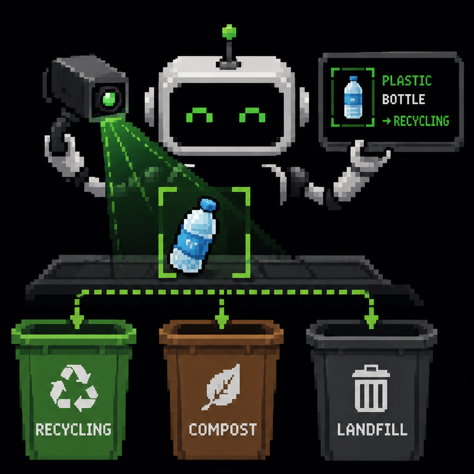
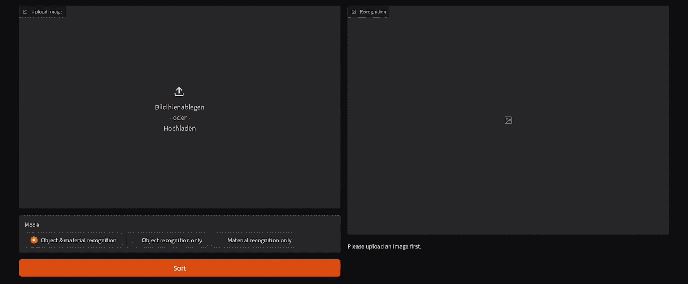
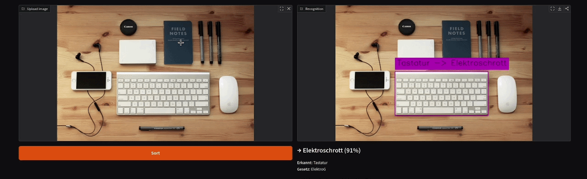
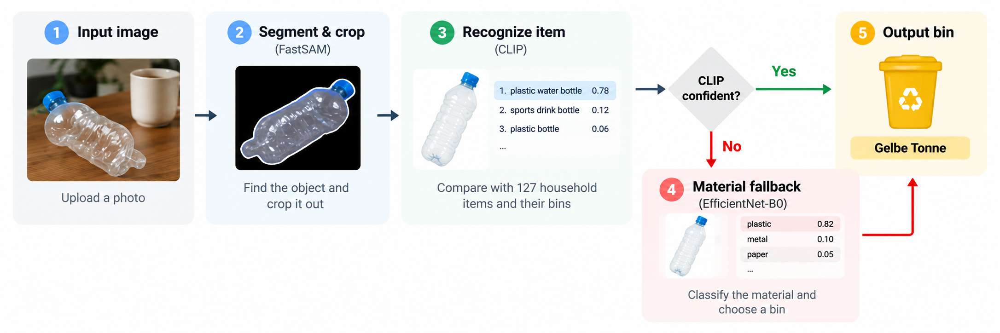
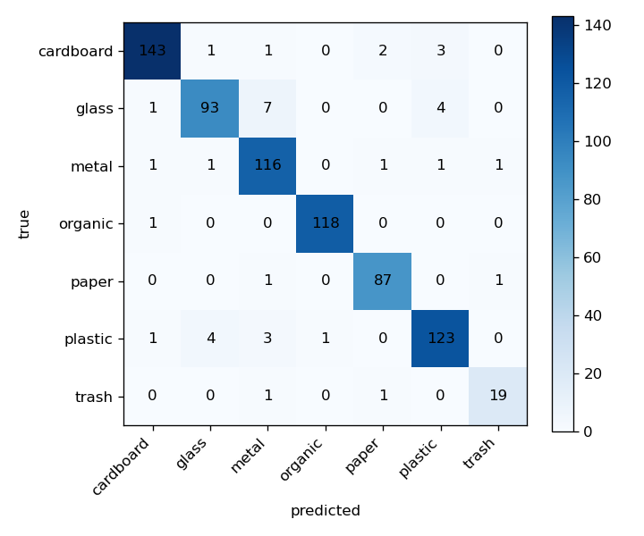

<div align="center">

  

# trashsort
</div>

### A smart trash sorter that recognizes items and tells you which German recycling bin they belong in. Built with Python, [PyTorch](https://github.com/pytorch/pytorch), [Gradio](https://github.com/gradio-app/gradio), [Ultralytics FastSAM](https://github.com/ultralytics/ultralytics), [OpenCLIP](https://github.com/mlfoundations/open_clip) and a self trained [EfficientNet-B0](https://github.com/garythung/trashnet) as a fallback

<div align="center">

  <hr>
  <a href="#how-it-works"><b>How it works</b></a> | <a href="#how-well-it-works"><b>Results</b></a> | <a href="#install"><b>Install</b></a>
  <hr>

  

  

</div>

## How it works

Upload a photo and trashsort runs it through a three stage pipeline:

  

1. **Cut out the object:** FastSAM finds the main object in your photo and crops it out

2. **Figure out what the object is:** CLIP (ViT-L/14) compares the crop against my list of 127 household items, where each item already knows which bin it belongs in

3. **Fall back to the material.** For things CLIP doesn't recognize, my own EfficientNet-B0 model looks at what the object is made of (cardboard, glass, metal, organic, paper, plastic or trash) and picks a bin based on that

### German bins it maps to:

| Bin | German              | Typical contents                      |
|-----------------|---------------------|---------------------------------------|
| `papier`        | Blaue Tonne         | paper, cardboard, boxes               |
| `gelbe_tonne`   | Gelbe Tonne / Sack  | plastic and metal packaging, composites |
| `altglas`       | Glascontainer       | glass bottles and jars                |
| `biomuell`      | Braune Tonne        | food and organic waste                |
| `restmuell`     | Schwarze Tonne      | residual waste                        |
| `pfand`         | Pfandrückgabe       | deposit bottles and cans              |
| `sondermuell`   | Schadstoffsammlung  | batteries, chemicals, paint, oil      |
| `elektroschrott`| Elektroschrott      | electronic waste                      |
| `altkleider`    | Altkleidercontainer | wearable clothes and shoes            |

## How well it works

<div align="center">

  
</div>

The self trained **EfficientNet-B0 material classifier** was tested on **737 new images** taken from across multiple datasets. It reaches **94.8% accuracy** across the 7 material classes.

To see how much the CLIP recognizer really adds, I built a set of **100 real world images** covering every bin and evaluated two setups:

| Method | Bin accuracy |
|--------|--------------|
| Material classifier only | **48.0%** |
| **Full pipeline** (FastSAM crop, CLIP recognizer, CNN fallback) | **85.0%** |

Putting the CLIP recognizer in front of the material classifier **nearly doubles** the correct bin rate, from about 48% to **85%**.

## Install

1. **Clone the repository**
```
git clone https://github.com/ris5266/trashsort.git
cd trashsort
```
 
2. **Install the dependencies**
```
pip install -r requirements.txt
pip install -e .
```
 
3. **Launch the Gradio app**
```
python -m trashsort.app
```

Optional:
1. **Train the material fallback classifier**
```
python scripts/download_trashnet.py     # TrashNet dataset
python scripts/download_organic.py      # organic dataset
python scripts/download_groceries.py    # supermarket dataset
python scripts/add_groceries.py         # map packaging -> material classes
python -m trashsort.train
```
 
2. **Fetch the eval images and run the benchmark**
```
python scripts/build_eval.py
python -m trashsort.eval_bins
```
